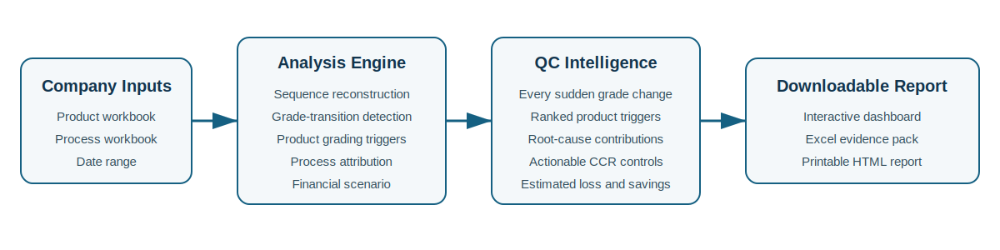
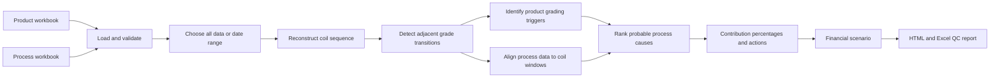

# MMCA Grade Transition Intelligence 

A reproducible Streamlit application for analysing sudden grade changes in
continuous-cast copper rod production.

The application accepts the two monthly files provided by Metrod Holdings Berhad - (MHB):

1. **CCR Coil Inspection details Master** containing product and coil-quality data
2. **Process_Values** containing timestamped CCR process measurements

It reconstructs the production sequence, detects every adjacent grade change,
identifies the product measurements that restricted the new grade, ranks
probable upstream process contributors, estimates the commercial exposure, and
generates a detailed report for Quality Control and Process Engineering.



## Application Link: (https://mmca-grade-transition-intelligence.streamlit.app)

## Problem statement

Copper rod is manufactured continuously and cut into coils according to customer
requirements. A grade change between two consecutive coils can disrupt customer
allocation, create off-plan inventory, require rework or remelting, and increase
metal wastage.

The analytical event is therefore the transition itself:

```text
Previous coil: Grade 5
Current coil:  Grade 4
                    ↑ sudden downgrade
```

The system answers two separate questions:

1. **Product trigger:** which measured product parameter explains why the new
   coil received its recorded grade?
2. **Process driver:** which upstream process behaviour changed before or during
   the affected coil window?

This distinction prevents the tool from incorrectly describing a product symptom,
such as high oxygen, as the upstream process cause.

## Main features

- Upload the two company Excel workbooks directly
- Analyse all uploaded data or a selected start and end date
- Reconstruct chronological production order
- Detect upgrades, downgrades, sustained shifts and one-coil fluctuations
- Flag startup, shutdown, manual-grade and contaminated-coil events
- Apply Revision 19 or Revision 20 grading rules according to production date
- Identify ranked product grading triggers
- Align process records to coil production windows
- Rank probable process drivers using robust statistical deviation, coil-to-coil
  change, data completeness and engineering relevance
- Calculate root-cause contribution percentages
- Generate Metrod CCR-specific corrective actions
- Estimate grade-fluctuation loss using daily copper prices and editable
  commercial assumptions
- Estimate potential savings and prospective net revenue protected
- Download a printable HTML report and a multi-sheet Excel evidence pack

## Application workflow



## Parameters considered

### Product and grading parameters

| Group | Parameters |
|---|---|
| Dimensions | Minimum and maximum rod diameter |
| Mechanical quality | Tensile strength, elongation, 15 × 15 twist, 25 RTF twist |
| Electrical quality | Conductivity |
| Surface quality | Large, medium and small Defectomat and Ferromat counts |
| Oxygen and oxides | Oxygen and total oxide content |
| Chemistry | Al, Sb, As, Bi, Cd, Fe, Pb, Ni, P, Se, S, Te, Sn and Zn |

The grading engine uses the approved criteria supplied in the Revision 19 and
Revision 20 documents. The production date determines the applicable revision.

### Important process parameters

| Group | Parameters |
|---|---|
| Thermal control | SV, HF, tundish, wheel, bar-entry and rolling-mill-entry temperatures |
| Casting and line speed | Rod speed and HF weight |
| Lubrication and NAPS | Soluble-oil temperature/concentration, IPA, NAPS flow/concentration and wax concentration |
| Cooling-flow balance | Wheel, band, side, bottom, nip-nozzle, after-cooler and stripper-shoe flows |

The SCU colour-coded channels are not ranked in Version 1 because their physical
meaning was not documented in the supplied files. They can be added after the
company confirms their engineering interpretation.

## Root-cause method

For each grade transition, the application:

1. Uses the preceding stable coils as a local baseline
2. Calculates the process mean during the affected coil window
3. Measures robust deviation from the baseline
4. Measures the change from the immediately preceding coil
5. Adjusts the score for data completeness
6. Adds a physical-relevance factor based on the product trigger
7. Ranks the strongest process candidates

The root-cause score is explainable but probabilistic. It indicates statistical
association and engineering plausibility, not proof of causation.

## Root-cause contribution percentage

For each transition, the scores of the leading candidates are normalised to
100%. Event contributions are weighted by affected coil-run tonnage and then
aggregated across the selected period.

This produces:

- Contribution by process group
- Contribution by individual process parameter
- Product-trigger frequency
- Action priorities

The percentages are attribution weights within this model, not experimentally
measured causal fractions.

## Actionable recommendations

Recommendations are generated for the leading root-cause groups.

Examples include:

- Stabilising tundish and bar-entry temperature control
- Balancing operator-side and machine-side wheel flows
- Inspecting blocked nozzles, filters and control valves
- Reducing abrupt rod-speed and casting-rate changes
- Tightening soluble-oil, IPA, NAPS and wax controls
- Linking charge-mix records to coil IDs for chemistry-related downgrades
- Repairing frozen, impossible or excessively incomplete sensor channels

Each recommendation includes a verification metric so the company can evaluate
whether the action reduced future transition frequency.

## Financial impact model

Actual realised price by coil grade, rework cost, remelt recovery and a clean structured planned-grade field were not present in the uploaded files. The financial output is therefore a transparent, editable scenario. For a downgrade, the preceding stable grade is used as the temporary commercial target unless the company later supplies a planned-grade table.

For each downgrade:

```text
Gross copper value
= affected run weight × daily copper benchmark

Commercial grade loss
= gross copper value × grade steps lost × grade-step penalty %

Additional Grade 0 loss
= gross copper value × remelt/recovery loss %

Potential savings
= estimated loss × preventable share × intervention effectiveness

Potential net revenue protected
= potential savings − implementation cost
```

The application can retrieve historical daily COMEX HG copper benchmark values
through Yahoo Finance and converts the quotation from USD per pound to USD per
metric tonne. COMEX Copper HG is quoted in U.S. dollars and cents per pound:
https://www.cmegroup.com/education/articles-and-reports/hedging-with-comex-copper-futures

The user can always override the market price and USD/MYR exchange rate.

**Important:** these are scenario estimates, not audited accounting losses. For
official use, replace the grade-step penalty and recovery assumptions with
company-approved commercial data.


## Product workbook compatibility

The application automatically detects the product table in either of these
Metrod worksheets:

- `Master`
- `Master_Simplified`

It also scans the first eight rows to locate the actual column header. This is
important because different exports may place the header on a different row.
The minimum required fields are `Coil ID`, `Date`, `Start Time`, and `Grade`.

Common simplified-sheet names such as `25 RTF Twist Test (Number)` and
`Oxide Content (Å)` are automatically translated to the canonical names used
by the grading engine.

## Installation

### Windows

1. Install Python 3.12.
2. Download or clone this repository.
3. Double-click:

```text
setup_windows.bat
```

4. Start the application with:

```text
run_local.bat
```

5. Open the displayed local URL, normally:

```text
http://localhost:8501
```

### Command line

```bash
python -m venv .venv
```

Windows:

```bash
.venv\Scripts\activate
```

macOS or Linux:

```bash
source .venv/bin/activate
```

Install and run:

```bash
python -m pip install --upgrade pip
python -m pip install -r requirements.txt
python -m streamlit run streamlit_app.py
```

## How to use

1. Upload the product workbook.
2. Upload the process workbook.
3. Choose **All uploaded data** or **Select date range**.
4. Adjust the process lag only when the line residence time is known.
5. Click **Run grade-change analysis**.
6. Review:
   - Overview
   - Transition investigator
   - Root causes and actions
   - Financial impact
7. Enter company-approved financial assumptions.
8. Download the HTML or Excel report.

## Repository structure

```text
mmca-streamlit/
├── streamlit_app.py
├── requirements.txt
├── setup_windows.bat
├── run_local.bat
├── README.md
├── DEPLOYMENT_GUIDE.md
├── config/
│   └── grading_rules.json
├── docs/
│   └── workflow.svg
├── src/
│   └── mmca/
│       ├── analysis.py
│       ├── constants.py
│       ├── finance.py
│       ├── grading.py
│       ├── io.py
│       └── reporting.py
└── tests/
```

## Deployment

The code is stored on GitHub, while the Python application is hosted through
Streamlit Community Cloud. GitHub Pages alone cannot execute the Python analysis
engine.

See [DEPLOYMENT_GUIDE.md](DEPLOYMENT_GUIDE.md) for the complete deployment
procedure.

Official Streamlit deployment documentation:

- https://docs.streamlit.io/deploy/streamlit-community-cloud/deploy-your-app/deploy
- https://docs.streamlit.io/deploy/streamlit-community-cloud/deploy-your-app/app-dependencies
- https://docs.streamlit.io/deploy/streamlit-community-cloud/deploy-your-app/file-organization

## Confidentiality

No company workbook is included in the repository.

When a user uploads data to a hosted Streamlit application, the files are sent
to the Streamlit application server for processing. For real company data:

- Use a private GitHub repository
- Deploy the Streamlit app as private
- Add only authorised viewer email addresses
- Do not log or persist uploaded file contents
- Do not commit generated reports containing customer or coil information
- Prefer local deployment if company policy prohibits cloud processing

Streamlit documents private app sharing here:
https://docs.streamlit.io/deploy/streamlit-community-cloud/share-your-app

## Limitations

- Raw-material causation requires timestamped cathode and scrap charge records
- Process lag should be calibrated using actual line distance and rod speed
- Manual-grade and contaminated events require human review
- Process scores require confirmation by QC and production engineers
- Financial figures depend on company-approved commercial assumptions
- This version does not replace the official grading procedure or operator judgement

## Recommended validation

Before operational adoption:

1. Select a sample of known transitions
2. Ask QC and production engineers to record the confirmed cause
3. Compare the confirmed cause with the top-ranked model candidates
4. Tune the baseline length, process lag and score threshold
5. Track precision of the top one and top three candidates
6. Review whether corrective actions reduce transition rate per 100 coils
